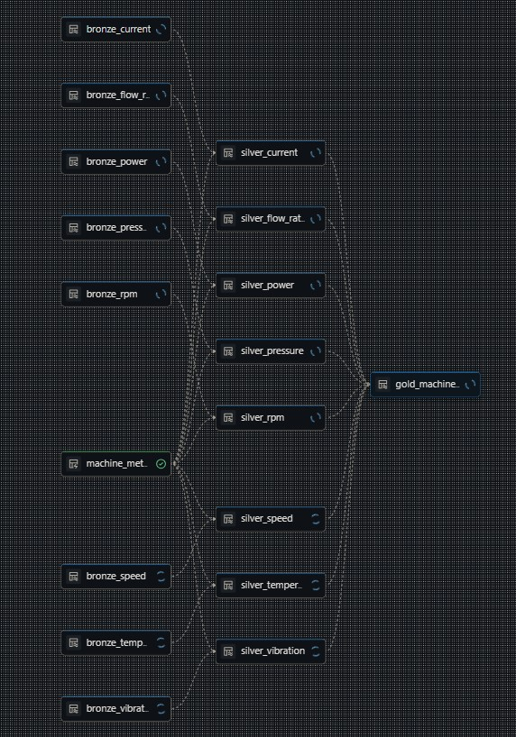

# Smart Manufacturing – Production Line Condition Monitoring
**Azure Databricks · Delta Live Tables · Medallion Architecture**

## Project Overview

This project implements an industrial IoT streaming pipeline for monitoring the health and performance of a production line. Using Azure Databricks, Delta Live Tables (DLT), and the Medallion Architecture, the pipeline ingests simulated sensor data from six critical machines, validates and enriches it, and produces analytics-ready metrics for condition monitoring, predictive maintenance, and operational insight.  

Each device emits continuous streaming data in Delta format, with event timestamps and randomized, realistic values.

---

## Objectives

1. **Simulate industrial IoT data** for a small production line with six critical machines.  
2. **Ingest raw sensor streams** into a Bronze layer using DLT streaming pipelines.  
3. **Validate, normalize, and enrich data** in the Silver layer, adding machine metadata.  
4. **Aggregate and compute actionable metrics** in the Gold layer (10-minute tumbling windows).  
5. **Demonstrate production-grade streaming ETL patterns** on Databricks (as of Dec 2025).  

---

## Architecture

The streaming pipeline follows a **Medallion architecture**, consisting of three main layers plus data generation and consumption:

| Layer / Stage                   | Description                                                                                  | Output / Purpose                               |
|---------------------------------|----------------------------------------------------------------------------------------------|------------------------------------------------|
| **IoT Sensor Stream Generator**  | Simulates industrial IoT sensor streams for six machines; generates raw event data.        | Continuous Delta files with timestamped events |
| **00_landing (Delta files)**     | Raw landing area for all sensor streams before processing.                                   | Raw Delta tables per sensor type              |
| **Bronze Layer**                 | Raw streaming ingestion using Delta Live Tables; preserves original sensor events.          | Bronze tables per sensor type; no transformations |
| **Silver Layer**                 | Validates and enriches streams using DLT expectations and machine metadata.                 | Analytics-ready Silver tables; cleaned and enriched |
| **Gold Layer**                   | Aggregates data per machine into time windows (avg, max, min) and prepares metrics.         | Gold tables for dashboards, alerts, and analytics |
| **Dashboards / Alerts / BI**     | Consumption layer for monitoring and decision-making; can integrate with Databricks SQL or BI tools. | Visualizations and operational insights       |

---

## Production Line Machines and Sensors

### Production Line Overview
The simulated production line consists of six critical machines operating in a small-to-medium industrial manufacturing environment. The line produces precision metal components, such as gears and shafts, which require high accuracy, strict quality control, and continuous monitoring to prevent downtime and defects.

### Product Description
- Type: Precision metal components (gears, shafts, brackets)
- Material: Steel or aluminum alloys
- Production Characteristics:
  - High precision and low tolerance deviation
  - Batch-oriented workflow, but monitored continuously
  - Critical monitoring for temperature, vibration, pressure, and operational speed to prevent defects and downtime

| Machine ID | Machine Name                | Sensor Type(s)            | Measurement Unit | Realistic Value Range        | Notes / Purpose |
|------------|----------------------------|--------------------------|----------------|-----------------------------|----------------|
| 1          | Main Drive Motor           | Temperature, Vibration, Power Consumption | °C, g, kW      | Temp: 40–90°C Vib: 0–0.08 g Power: 10–50 kW | Critical motor; vibration indicates bearing health; power for load monitoring |
| 2          | Conveyor Belt Motor        | Temperature, Vibration, Belt Speed         | °C, g, m/s     | Temp: 35–75°C Vib: 0–0.05 g Speed: 0.5–2.5 m/s | Conveyor belt operation; vibration for misalignment; speed for throughput |
| 3          | Hydraulic Press            | Temperature, Pressure, Cycle Count         | °C, bar, cycles| Temp: 40–85°C Pressure: 100–300 bar Cycles: 0–60 per min | High-pressure system; pressure ensures safety; cycles for workload monitoring |
| 4          | CNC Spindle                | Temperature, Vibration, RPM                | °C, g, RPM     | Temp: 35–80°C Vib: 0–0.06 g RPM: 500–5000 | Rotational tool; vibration indicates wear; RPM for speed control |
| 5          | Cooling System Pump        | Temperature, Flow Rate                      | °C, L/min      | Temp: 20–60°C Flow: 50–200 L/min | Keeps equipment within safe operating temperature |
| 6          | Packaging Unit Motor       | Temperature, Vibration, Motor Current      | °C, g, A       | Temp: 30–70°C Vib: 0–0.05 g Current: 5–20 A | Drives packaging mechanism; vibration and current indicate mechanical load |

---

## Data Generation Strategy

- Streaming simulation using Python and Spark.  
- Each machine emits sensor readings every **60 seconds** with slight randomized latency.  
- Event timestamps (`event_time`) are slightly randomized to simulate realistic IoT conditions.  
- Multiple metrics per machine can be handled in separate Delta tables or combined streams.  
- The generator supports **parallel streams** for all machines simultaneously.  

---
## Machine Health KPI

### Overview

The Machine Health KPI provides a single, interpretable indicator of the operational condition of each machine in the production line.  
It is calculated continuously from multiple real-time sensor streams and aggregated in fixed time windows using Databricks Delta Live Tables (DLT).

The KPI is designed to:
- Detect early signs of mechanical degradation
- Support predictive maintenance
- Reduce unplanned downtime
- Enable operational dashboards and automated alerts

---

### Input Signals

The Machine Health KPI is derived from the following sensor metrics:

| Sensor Metric | Description | Purpose |
|--------------|------------|---------|
| Temperature | Average operating temperature | Detects overheating and cooling issues |
| Vibration | Maximum vibration level | Indicates bearing wear and mechanical imbalance |
| Power Consumption | Average power usage | Reflects mechanical load and efficiency |

All metrics are aggregated per machine using 10-minute tumbling windows based on event time.

---

### Normalization

Each metric is normalized against a defined maximum safe operating threshold:

| Metric | Normalization Formula | Max Threshold |
|------|----------------------|---------------|
| Temperature | `avg_temperature / 90` | 90 °C |
| Vibration | `max_vibration / 0.08` | 0.08 g |
| Power Load | `avg_power / 50` | 50 kW |

Normalized values are capped at `1.0` to prevent outliers from skewing the KPI.

---

### Health Score Calculation

The Machine Health Score is computed as a weighted inverse of the normalized metrics:

Machine Health Score =
100 × (
0.30 × (1 − Temperature Score) +
0.40 × (1 − Vibration Score) +
0.30 × (1 − Load Score)
)

- Score range: 0–100
- Higher score indicates a healthier machine
- Vibration is weighted more heavily due to its strong correlation with mechanical failure

---

### Health Status Classification

Each machine is assigned a categorical health status based on the computed score:

| Health Score | Status | Interpretation |
|-------------|--------|----------------|
| ≥ 80 | HEALTHY | Normal operation |
| 50–79 | WARNING | Degradation detected, maintenance recommended |
| < 50 | CRITICAL | High failure risk, immediate action required |

---

### Output

The KPI is stored in the Gold layer of the Databricks Delta Live Tables pipeline and includes:

- Machine ID and machine name
- Time window (start and end)
- Aggregated sensor values
- Machine Health Score
- Machine Health Status

This dataset is optimized for:
- Databricks SQL dashboards
- BI tools (Power BI, Tableau)
- Alerting systems
- Predictive maintenance analytics

---

### Implementation Environment

The Machine Health KPI is implemented entirely within Databricks Delta Live Tables (DLT):

- **Bronze layer**: raw sensor streams
- **Silver layer**: validated and enriched sensor data with machine metadata
- **Gold layer**: aggregated metrics, including the Machine Health KPI
- Continuous computation and automatic handling of late-arriving data via event-time watermarking

---

### Why This KPI Matters

By consolidating multiple sensor streams into a single health indicator, the Machine Health KPI enables:

- Faster operational decision-making
- Reduced monitoring noise
- Scalable machine-level observability
- Clear communication between engineering and operations teams

---

## Bronze Layer

**Notebook:** `01_bronze_processing`  

- Raw sensor ingestion from Delta streams.  
- Separate Bronze tables per sensor type:
  - `main_motor_temperature`
  - `main_motor_vibration`
  - `main_motor_power`  
  - ... (similar tables for each machine and sensor)
- Preserves original event timestamps and values.

Bronze tables store raw sensor events without pipeline-specific processing metadata. Streaming offsets and Delta Lake checkpoints are used to guarantee exactly-once processing.

---

## Silver Layer

**Notebook:** `02_silver_processing`  

- Applies DLT expectations for:
  - Non-null `event_time`  
  - Valid sensor value ranges (as in the table above)  
- Normalizes schemas (`timestamp`, `machine_id`)  
- Enriches events with **static machine metadata**:
  - Machine name  
  - Type / location / line section etc
- Prepares data for analytics-ready aggregations.
  
Static machine metadata is maintained as a Silver-level Delta Live Table and used to enrich all sensor streams. The metadata describes machine function, location, criticality, and monitored sensor types, enabling contextualized monitoring and analytics across the production line.

---

## Gold Layer

**Notebook:** `03_gold_processing`  

- Aggregates data into 10-minute tumbling windows per machine:  
  - Average temperature  
  - Maximum vibration  
  - Maximum load / pressure / flow / current as appropriate  
- Uses **event-time processing** with 2-minute watermarks  
- Joins multiple sensor streams for a single machine into one analytics-ready record  
- Ready for:
  - Dashboards  
  - Alerting (threshold breaches)  
  - Predictive maintenance analytics  

---

## Key Design Principles

- **Medallion architecture**: Bronze → Silver → Gold  
- **Data quality as code** with DLT expectations  
- **Event-time correctness** and watermarking  
- **Production-grade streaming** using Databricks ETL pipelines  
- **Extensible and modular**: easy to add new machines or sensors  

---

## Possible Extensions

- **Anomaly detection** using vibration and temperature trends  
- **Predictive maintenance alerts** when thresholds are exceeded  
- **Integration with factory MES / SCADA systems**  
- **Historical analysis and KPI dashboards**  

---
# Lessons Learned: Building a Delta Live Tables Streaming Pipeline

## Overview
This was streaming pipeline implementation using Databricks Delta Live Tables (DLT). The development process involved several challenging technical issues. Below are the key learnings that might help others avoid similar pitfalls.

---

### Issue 1: Data Quality Expectations Referencing Wrong Columns
**Problem:** Pipeline execution failed due to expectations referencing original column names instead of renamed columns.

**Key Learning:** Always ensure `@dlt.expect()` conditions reference the final column names after all transformations.

---

### Issue 2: Stream-to-Batch Join with Static Reference Data
**Problem:** Unclear whether to use `dlt.read()` or `dlt.read_stream()` when joining static metadata with streaming sensor data.

**Key Learning:**  
- Use `dlt.read()` for static reference tables (like metadata).  
- Use `dlt.read_stream()` for streaming data sources.  
- Optionally, broadcast small static tables for join performance.

---

### Issue 3: PySpark Type Error with `least()` Function
**Problem:** PySpark functions that operate on columns require Column objects, not raw literals.

**Key Learning:** Always wrap numeric literals with `lit()` when using column-based functions like `least()`.

---

### Issue 4: Streaming Aggregation Without Watermark Fails in Append Mode
**Problem:** Aggregations without watermarks caused pipeline to fail in append mode.

**Key Learning:** Always set a watermark when performing streaming aggregations in append mode to handle late-arriving data.

---

### Issue 5: Stream-to-Stream Joins Can Produce Zero Rows
**Problem:** Gold table remained empty despite data in silver tables due to event timestamp mismatches between streams.

**Key Learning:**  
- Aggregate each stream individually before joining.  
- Avoid direct joins between streaming DataFrames during development.  
- Use static or batch views for joins if possible.

---

### Issue 6: Windowing Delays Row Emission
**Observation:** 10-minute windows combined with watermarks delayed output rows to the gold table.

**Key Learning:**  
- Use smaller windows during development to speed up testing.  
- Understand that in production, rows will appear after window end plus the watermark interval.

---

## Bottom Line
Building a Delta Live Tables streaming pipeline requires careful handling of:

- Column references in expectations  
- Watermarks for aggregations  
- Static vs streaming data reads  
- Stream-to-stream joins and event time alignment  
- Window sizes and output latency  

Step-by-step debugging and testing individual streams first greatly reduces the risk of empty outputs or runtime errors.

---

## Author

tauimonen  
Azure Databricks · Data Engineering · Streaming Analytics
---
